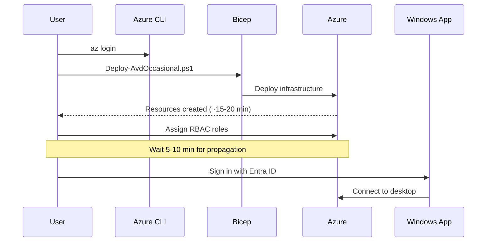

Get your Azure Virtual Desktop environment running in approximately 5 minutes.

## Prerequisites Checklist

Before starting, ensure you have:

- Azure CLI v2.40+ installed.
- Bicep CLI (included with Azure CLI v2.20+).
- PowerShell 5.1+.
- Azure subscription with Contributor role.
- Entra ID user account.
- Strong admin password for session hosts.

For detailed prerequisites, see [Prerequisites Guide](/docs/prerequisites/).

## Deployment flow



## 1. Clone and Authenticate

```powershell
git clone https://github.com/markheydon/avd-occasional.git
cd avd-occasional
az login
az account show  # Verify correct subscription
```

## 2. Deploy Infrastructure (15-20 minutes)

```powershell
# When prompted, enter a strong admin password for the session host VMs
.\scripts\Deploy-AvdOccasional.ps1
```

This creates all Azure Virtual Desktop resources: virtual network, host pool, session hosts, and more.

## 3. Assign Role Permissions (Required)


Users cannot connect without these role assignments.


Role assignments are manual post-deploy steps today. Automating them via Bicep is tracked in [issue #3](https://github.com/markheydon/avd-occasional/issues/3).

### Role 1: Desktop Virtualization User (Application Group)

```powershell
$appGroupId = (az resource list --resource-group avd-occasional-rg `
  --resource-type "Microsoft.DesktopVirtualization/applicationGroups" `
  --query '[0].id' -o tsv)

$userId = (az ad signed-in-user show --query id -o tsv)

az role assignment create `
  --role "Desktop Virtualization User" `
  --assignee $userId `
  --scope $appGroupId
```

### Role 2: VM sign-in (Session Host VMs)

Assign **one** of the following roles on each session host VM. You do not need both.





#### Option A: Virtual Machine User Login (default)

Standard user sign-in. Use this for occasional desktop use where you do not need to install software or change system settings.

```powershell
$userId = (az ad signed-in-user show --query id -o tsv)
$vmIds = @(az vm list --resource-group avd-occasional-rg --query '[].id' -o tsv)

foreach ($vmId in $vmIds) {
    az role assignment create `
      --role "Virtual Machine User Login" `
      --assignee $userId `
      --scope $vmId
}
```





#### Option B: Virtual Machine Administrator Login (developers)

Sign in with your Entra ID account **and** local administrator rights. Use this if you need to install development tools, change system settings, or perform other admin tasks while signed in with your normal Entra identity.

```powershell
$userId = (az ad signed-in-user show --query id -o tsv)
$vmIds = @(az vm list --resource-group avd-occasional-rg --query '[].id' -o tsv)

foreach ($vmId in $vmIds) {
    az role assignment create `
      --role "Virtual Machine Administrator Login" `
      --assignee $userId `
      --scope $vmId
}
```

To assign admin rights to a different user, replace the first line with:

```powershell
$userId = (az ad user show --id "you@yourtenant.onmicrosoft.com" --query id -o tsv)
```


This role grants full local administrator access on the VM. Use it for personal development desktops; avoid it for shared or production-style hosts.






**Alternative:** The `avdadmin` local account created during deployment also has administrator rights, but you must sign in with that separate account and password rather than your Entra ID credentials.

**Allow 5–10 minutes for roles to propagate before connecting.** If you are already signed in and change the VM login role, sign out and reconnect for the new privileges to take effect.

## 4. Connect to Your Desktop

1. Install [Windows App](https://apps.microsoft.com/detail/9n1f85v9t8bn) from Microsoft Store.
2. Open Windows App and sign in with your Entra ID account.
3. Select the "Personal Desktop" workspace.
4. Launch your desktop.

You're now connected and can start working!

## Next Steps

### Save Costs Between Sessions

When finished working, deallocate VMs to save ~98% on compute costs:


Your desktop, files, and applications are fully preserved. Only VM compute is paused; disks remain.


```powershell
.\scripts\Stop-AvdOccasional.ps1
```

Restart whenever you need the desktop:

```powershell
.\scripts\Start-AvdOccasional.ps1
```

### Explore Further

- [Architecture Overview](/docs/architecture/) – Understand the infrastructure.
- [Full Deployment Guide](/docs/deployment-detailed/) – Detailed walkthrough and customisation.
- [Troubleshooting](/docs/troubleshooting/) – Common issues and solutions.
- [PowerShell Scripts Reference](/docs/scripts/) – Available commands and options.

### Issues?

See [Troubleshooting Guide](/docs/troubleshooting/) for common problems and solutions.

---

**Estimated time to first connection**: 25–30 minutes (15–20 min deployment + 5–10 min role propagation).

---

**Last Updated**: July 2026