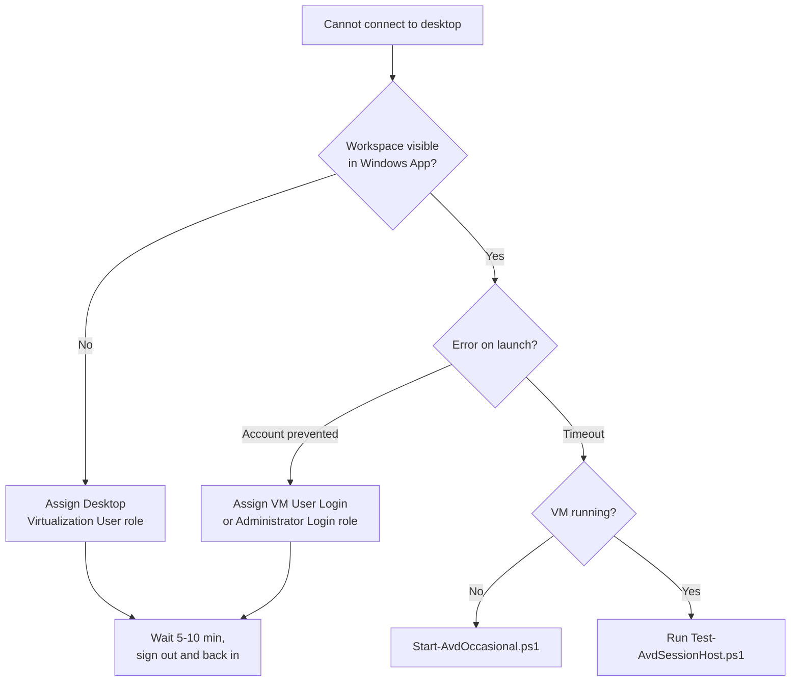
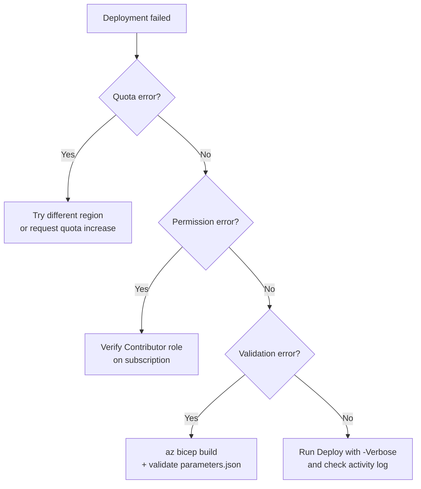

Solutions for common issues encountered during deployment and operation.

## Connection troubleshooting



## Deployment troubleshooting



## Deployment Issues

### Error: "The subscription does not have quota"

**Symptoms:** Deployment fails with quota-related error message.

**Causes:** 
- Chosen region has resource quotas reached.
- Subscription-level limits hit (e.g., maximum VMs).
- Resource provider not registered.

**Solutions:**

1. Try a different region:
```powershell
# List supported regions
az provider show --namespace Microsoft.Compute `
  --query "resourceTypes[?resourceType=='virtualMachines'].locations" -o table

# Update parameters.json
"location": { "value": "northeurope" }

# Retry deployment
.\scripts\Deploy-AvdOccasional.ps1
```

2. Request quota increase:
   - Go to Azure Portal
   - Navigate to **Quotas** (search bar)
   - Select **Compute** and your region
   - Click quota item and select "+ New Quota Request"
   - Request increase for D2s_v5 VMs (or B2s for light workload)

3. Register required resource providers:
```powershell
az provider register --namespace Microsoft.Compute
az provider register --namespace Microsoft.Network
az provider register --namespace Microsoft.DesktopVirtualization
```

### Error: "InvalidTemplateDeployment" or "ValidationError"

**Symptoms:** Deployment fails at validation stage with cryptic error message.

**Causes:**
- Malformed parameters.json.
- Bicep syntax error.
- Missing or invalid parameter value.
- Region doesn't support required resources.

**Solutions:**

1. Validate template locally:
```powershell
az deployment group validate `
  --resource-group avd-occasional-rg `
  --template-file infra/main.bicep `
  --parameters @infra/parameters.json `
  -o json | ConvertFrom-Json | .errors
```

2. Check for Bicep lint errors:
```powershell
az bicep build infra/main.bicep
```

3. Verify parameters.json syntax:
```powershell
# Check for JSON errors
$params = Get-Content infra/parameters.json -Raw | ConvertFrom-Json
```

4. Check that all resources are available in your region:
```powershell
az provider list --query "[?registrationState=='Registered'].namespace" -o tsv
```

### Error: "User does not have permissions"

**Symptoms:** Deployment fails with "Insufficient permissions" or "Unauthorized" error.

**Causes:**
- Azure account doesn't have Contributor role on subscription.
- Service Principal lacks required permissions.
- Insufficient permission for role assignments.

**Solutions:**

1. Verify your role:
```powershell
az role assignment list --assignee (az account show --query user.name -o tsv)
```

Output should include `Contributor` or `Owner` role.

2. If insufficient permissions, request access:
   - Contact your subscription owner/administrator
   - Ask for Contributor role assignment on the subscription (not resource group)
   - Verify via above command after access granted

3. If using Service Principal, ensure it has required permissions:
```powershell
# List permissions
az role assignment list --assignee <service-principal-id>
```

### Error: "The template contains invalid syntax"

**Symptoms:** Bicep build or deployment fails with syntax error.

**Causes:**
- Bicep code has typos or invalid constructs.
- Parameter file malformed JSON.
- PowerShell script has syntax errors.

**Solutions:**

1. Re-clone repository to get latest correct version:
```powershell
rm -Recurse avd-occasional  # Remove local copy
git clone https://github.com/markheydon/avd-occasional.git
cd avd-occasional
```

2. Run Bicep lint to identify issues:
```powershell
# Lint all Bicep files
Get-ChildItem -Recurse -Filter "*.bicep" | ForEach-Object {
    az bicep build $_.FullName
}
```

3. Manually inspect `parameters.json` for malformed JSON:
   - Check for trailing commas
   - Ensure all braces and brackets are balanced
   - Verify string values are quoted with double quotes

## Diagnosis with Test-AvdSessionHost

The `Test-AvdSessionHost.ps1` script provides automated diagnostics for session host issues. Run it first when troubleshooting connectivity problems:

```powershell
# Auto-discover and diagnose
.\scripts\Test-AvdSessionHost.ps1
```

The script checks:
- VM power state (running/deallocated).
- VM extensions (AADLoginForWindows, DSC).
- Session host status in AVD host pool (Available/Unavailable).
- Entra ID RDP properties (authentication configuration).
- AVD agent heartbeat (last reported time).

Review the **Recommendations** section in script output for next steps. Then consult the relevant troubleshooting section below for detailed solutions.

### Error: DSC extension fails or session host does not register

**Symptoms:** Deployment succeeds but the session host never appears in the host pool, or the DSC extension reports failure.

**Causes:**
- Outdated `artifactsLocation` URL in `parameters.json`.
- Network connectivity issues preventing DSC artifact download.
- Registration token expired before DSC ran.

**Solutions:**

1. Check the DSC extension status in Azure Portal (VM → Extensions).
2. Verify the `artifactsLocation` value in `infra/parameters.json` — see [AVD DSC Artifact URL](/docs/deployment-detailed/#avd-dsc-artifact-url) for how to update it.
3. Confirm outbound connectivity (public IP on NIC, NSG allows required egress).
4. Redeploy or re-run the DSC extension after updating the artifact URL.

---

## Connection Issues

### Error: "Workspace not available in Windows App"

**Symptoms:** User signs into Windows App but sees no workspaces available.

**Causes:**
- Desktop Virtualization User role not assigned.
- Role assignment not yet propagated.
- User not assigned to correct Application Group.
- Workspace not configured correctly.

**Solutions:**

1. Run diagnostics first:
   ```powershell
   .\scripts\Test-AvdSessionHost.ps1
   ```
   If session host status is "Available", role assignment may be the issue. Otherwise, see the script output for other problems.

2. Verify role assignment exists:
```powershell
$appGroupId = (az resource list --resource-group avd-occasional-rg `
  --resource-type "Microsoft.DesktopVirtualization/applicationGroups" `
  --query '[0].id' -o tsv)

az role assignment list --scope $appGroupId --query "[].{Principal:principalName, Role:roleDefinitionName}" -o table
```

2. If role missing, assign it:
```powershell
$userId = (az ad signed-in-user show --query id -o tsv)
az role assignment create `
  --role "Desktop Virtualization User" `
  --assignee $userId `
  --scope $appGroupId
```

3. **Wait 5–10 minutes** for role to propagate in Azure AD.

4. Sign out of Windows App completely, then sign back in.

5. Verify Desktop Application Group exists and is linked to Workspace:
```powershell
az desktopvirtualization applicationgroup list `
  --resource-group avd-occasional-rg `
  --query "[].{Name:name, Type:applicationType, WorkspaceName:workspaceName}" -o table
```

### Error: "Your account is configured to prevent you from using this device"

**Symptoms:** User successfully connects to Windows App and sees workspace, but gets error when launching desktop.

**Causes:**
- Virtual Machine User Login role not assigned to user.
- Role not yet propagated.
- Session host VM is stopped or not running.

**Solutions:**

1. Run diagnostics first:
   ```powershell
   .\scripts\Test-AvdSessionHost.ps1
   ```
   If session host status is "Available", review the output:
   - If Power State is "VM deallocated", start VMs with `.\scripts\Start-AvdOccasional.ps1`
   - If extensions show errors, redeploy with `.\scripts\Deploy-AvdOccasional.ps1`
   - If Entra ID auth is missing, check RDP properties and redeploy
   - If heartbeat is old, restart the VM
   
   If session host is not Available, continue below.

2. Verify Virtual Machine User Login role is assigned:
```powershell
$userId = (az ad signed-in-user show --query id -o tsv)
$vmIds = @(az vm list --resource-group avd-occasional-rg --query '[].id' -o tsv)

foreach ($vmId in $vmIds) {
    $roles = @(az role assignment list --scope $vmId --assignee $userId `
      --query "[].roleDefinitionName" -o tsv)
    if ($roles) {
        Write-Host "VM $(Split-Path $vmId -Leaf): $($roles -join ', ')"
    } else {
        Write-Host "VM $(Split-Path $vmId -Leaf): NO ROLES ASSIGNED"
    }
}
```

2. If role missing, assign it:
```powershell
$userId = (az ad signed-in-user show --query id -o tsv)
$vmIds = @(az vm list --resource-group avd-occasional-rg --query '[].id' -o tsv)

foreach ($vmId in $vmIds) {
    az role assignment create `
      --role "Virtual Machine User Login" `
      --assignee $userId `
      --scope $vmId
}
```

3. **Wait 5–10 minutes** for roles to propagate.

4. Verify VMs are running:
```powershell
az vm list --resource-group avd-occasional-rg `
  --query "[].{Name:name, PowerState:powerState}" -o table
```

If stopped, start them:
```powershell
.\scripts\Start-AvdOccasional.ps1 -WaitForStartup
```

### Error: Cannot Connect to Session Host (Network Timeout)

**Symptoms:** Connection attempt times out or fails with network unreachable error.

**Causes:**
- VM is stopped or deallocated
- Network Security Group blocking traffic
- Azure Virtual Desktop service temporarily unavailable
- Local firewall blocking Windows App

**Solutions:**

1. Verify VM is running:
```powershell
az vm list --resource-group avd-occasional-rg `
  --query "[].{Name:name, PowerState:powerState, ProvisioningState:provisioningState}" -o table
```

Start if needed:
```powershell
.\scripts\Start-AvdOccasional.ps1 -WaitForStartup
```

2. Check Network Security Group rules:
```powershell
$nsgId = (az resource list --resource-group avd-occasional-rg `
  --resource-type "Microsoft.Network/networkSecurityGroups" `
  --query '[0].id' -o tsv)

az network nsg rule list --resource-group avd-occasional-rg `
  --nsg-name (Split-Path $nsgId -Leaf) -o table
```

NSG should allow outbound traffic. If all rules are "Deny", access is blocked.

3. Verify local network connectivity:
   - Temporarily disable personal firewall or VPN
   - Try connecting from a different network (e.g., mobile hotspot)
   - Check if ISP blocks Azure Virtual Desktop traffic

4. Wait a few minutes and try again (Azure Virtual Desktop service may be refreshing).

## VM & Post-Deployment Issues

### VMs Not Appearing or Stuck in "Creating" State

**Symptoms:** Deployment appears to complete, but VMs don't show in resource list or remain stuck in Provisioning state.

**Quick Check:** Run diagnostics:
```powershell
.\scripts\Test-AvdSessionHost.ps1
```
Review output for extension status and session host registration status.

**Causes:**
- Deployment still in progress (check actual status).
- Deployment failed silently.
- Resource group query filtered wrong type.
- VM extension failed.

**Solutions:**

1. Check VM and extension status via diagnostics:
   ```powershell
   .\scripts\Test-AvdSessionHost.ps1
   ```
   If extensions show failed status, see recommendations in the output.

2. Check actual deployment status:
```powershell
# Get latest deployment
$deployment = (az deployment group list --resource-group avd-occasional-rg `
  --query '[-1]' | ConvertFrom-Json)

Write-Host "Deployment: $($deployment.name)"
Write-Host "State: $($deployment.properties.provisioningState)"
Write-Host "Timestamp: $($deployment.properties.timestamp)"

# View detailed error (if failed)
if ($deployment.properties.provisioningState -ne 'Succeeded') {
    $deployment.properties.error | ConvertTo-Json
}
```

3. Check VM extension status (Custom Script installation):
```powershell
$vmExtensions = @(az vm extension list --resource-group avd-occasional-rg `
  --vm-name (az vm list --resource-group avd-occasional-rg --query '[0].name' -o tsv) `
  --query "[].{Name:name, ProvisioningState:provisioningState, TypeHandlerVersion:typeHandlerVersion}")

$vmExtensions | ConvertTo-Json
```

If extension failed, re-run:
```powershell
.\scripts\Deploy-AvdOccasional.ps1 -WhatIf
```

4. Rerun deployment (idempotent safe):
```powershell
.\scripts\Deploy-AvdOccasional.ps1
```

### High Unexpected Costs

**Symptoms:** Azure bill significantly higher than £94–126/month (active) or £2–3/month (deallocated).

**Causes:**
- VMs still running (should deallocate after use)
- Data egress charges (large file downloads/uploads)
- Public IPs not being deleted during stop
- Other resources left running (databases, etc.)

**Solutions:**

1. Check VM power states:
```powershell
az vm list --resource-group avd-occasional-rg `
  --query "[].{Name:name, PowerState:powerState}" -o table
```

If running, stop them:
```powershell
.\scripts\Stop-AvdOccasional.ps1
```

2. Verify Public IPs are deleted when VMs stopped:
```powershell
# Check if Public IPs exist (should be empty when VMs stopped)
az network public-ip list --resource-group avd-occasional-rg `
  --query "[].{Name:name, IpAddress:ipAddress}" -o table
```

**Note:** Public IPs are automatically managed by Start/Stop scripts. If IPs remain after stopping, check script executed successfully.

3. Monitor data egress:
   - Go to Azure Cost Management (Portal)
   - Filter by charge type, resource group
   - Identify which resources generate data costs
   - Reduce file transfers or move data within Azure region

4. Review for unexpected resources:
```powershell
# List all resources by type
az resource list --resource-group avd-occasional-rg `
  --query "[].{Name:name, Type:type, CostRelevant:type}" -o table
```

Delete any resources created accidentally (databases, additional storage, etc.):
```powershell
# Example: Delete unexpected database
az resource delete --resource-group avd-occasional-rg --name <resource-name> --resource-type <type>
```

## Script & Automation Issues

### PowerShell Execution Policy Error

**Symptoms:** Script fails with "cannot be loaded because running scripts is disabled on this system".

**Causes:** PowerShell execution policy blocks script execution.

**Solutions:**

1. Check current policy:
```powershell
Get-ExecutionPolicy
```

2. Temporarily allow scripts for current user/session:
```powershell
Set-ExecutionPolicy -ExecutionPolicy RemoteSigned -Scope CurrentUser
```

3. Run script:
```powershell
.\scripts\Deploy-AvdOccasional.ps1
```

4. (Optional) Revert execution policy:
```powershell
Set-ExecutionPolicy -ExecutionPolicy Restricted -Scope CurrentUser
```

### Script Parameter Not Recognised

**Symptoms:** Running script with `-Parameter value` results in "Parameter not found" error.

**Causes:**
- Typo in parameter name
- PowerShell doesn't recognise parameter
- Script version mismatch

**Solutions:**

1. Check available parameters:
```powershell
Get-Help .\scripts\Deploy-AvdOccasional.ps1 -Parameter *
```

2. Verify that you're using a valid parameter name and spelling, matching what `Get-Help` shows:
   - Example parameter: `-AdminPassword`
   - PowerShell parameter names are case-insensitive, so `-AdminPassword` and `-adminPassword` are treated the same.

3. Re-clone repository in case script is outdated:
```powershell
git clone https://github.com/markheydon/avd-occasional.git
```

## General Debugging

### Enable Detailed Logging

For deployments, add `-Verbose` flag:

```powershell
.\scripts\Deploy-AvdOccasional.ps1 -Verbose
```

For Azure CLI commands:

```powershell
az deployment group create ... --debug
```

### Check Azure Activity Log

```powershell
# Show recent Azure activities
az monitor activity-log list --max-events 20 `
  --query "[].{Time:eventTimestamp, EventName:eventName, Status:status, Message:description}" -o table
```

### Collect Diagnostics

```powershell
# Export all resource details for debugging
az resource list --resource-group avd-occasional-rg -o json > resources.json

# Export deployment details
az deployment group show --resource-group avd-occasional-rg --name main -o json > deployment.json
```

### Contact Support

If you cannot resolve the issue:

1. Gather diagnostics:
   - Output of: `az account show`
   - Output of: `az resource list --resource-group avd-occasional-rg`
   - Recent error messages (copy full text)
   - Steps already tried

2. Report issue on [GitHub Issues](https://github.com/markheydon/avd-occasional/issues)

---

**Next**: [PowerShell Scripts Reference](/docs/scripts/)

---

**Last Updated**: July 2026